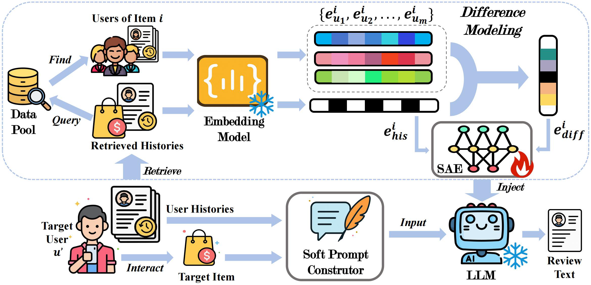
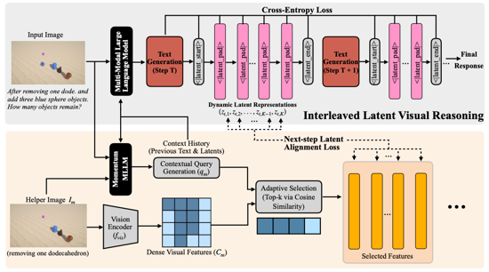

    <h1 style="display: inline-flex; align-items: center;">
        
        Awesome Latent Space
    </h1>

    
    
    
    

This repository manually collects works in **latent space**, which will be continuously updated.

## 📖 News
**[2025/11/30]** We release the initial version!

## 🌟 Overview
Here, we classify all the latent space based methods two categories, and sort by date in ascending order:
- [📖 News](#-news)
- [🌟 Overview](#-overview)
- [🤝 Contributing](#-contributing)
- [🔥 Methods](#-methods)
  - [LLM-based](#llm-based)
  - [VLM-based](#vlm-based)
  - [MAS-based](#mas-based)

## 🤝 Contributing
We warmly welcome contributions of excellent resources you find via **pull request**. Please follow the instruction in **CONTRIBUTING.md** if you want to make one.
Additionally, if you want to have any other issue, please add this wechat group.

## 🔥 Methods
### LLM-based

| Date     | Paper Title                                                                                                                                                                                                    | Introduction                                                        | Code                                                                                       |
|----------|----------------------------------------------------------------------------------------------------------------------------------------------------------------------------------------------------------------|---------------------------------------------------------------------|--------------------------------------------------------------------------------------------|
| 2024/12  |    [Training Large Language Models to Reason in a Continuous Latent Space](https://arxiv.org/abs/2412.06769)                                        |         | [Github](https://github.com/facebookresearch/coconut)                                      |
| 2024/12  |    [Deliberation in Latent Space via Differentiable Cache Augmentation](https://arxiv.org/abs/2412.17747)                                           |    | -                                                                                          |
| 2025/02  |    [Reasoning with Latent Thoughts: On the Power of Looped Transformers](https://arxiv.org/pdf/2502.17416)                                          |       | -                                                                                          |
| 2025/02  |    [SoftCoT: Soft Chain-of-Thought for Efficient Reasoning with LLMs](https://arxiv.org/abs/2502.12134)                                               |        | [Github](https://github.com/xuyige/SoftCoT)                                                |
| 2025/02  |     [CODI: Compressing Chain-of-Thought into Continuous Space via Self-Distillation](https://arxiv.org/abs/2502.21074)                            |            | [Github](https://github.com/zhenyi4/codi)                                                  |
| 2025/02  |    [Token Assorted: Mixing Latent and Text Tokens for Improved Language Model Reasoning](https://arxiv.org/abs/2502.03275)                          |           | -                                                                                          |
| 2025/03  |    [Reasoning to Learn from Latent Thoughts](https://arxiv.org/abs/2503.18866?)                                                                     |            | [Github](https://github.com/ryoungj/BoLT)                                                  |
| 2025/05  |    [Think Silently, Think Fast: Dynamic Latent Compression of LLM Reasoning Chains](https://arxiv.org/abs/2505.16552)                         |           | [Github](https://github.com/xiaomi-research/colar)                                         |
| 2025/05  |    [Soft Reasoning: Navigating Solution Spaces in Large Language Models through Controlled Embedding Exploration](https://arxiv.org/abs/2505.24688) |            | [Github](https://github.com/alickzhu/Soft-Reasoning)                                       |
| 2025/05  | [Seek in the Dark: Reasoning via Test-Time Instance-Level Policy Gradient in Latent Space](https://arxiv.org/abs/2505.13308)                                                                                   |     | [Github](https://github.com/bigai-nlco/LatentSeekhttps://github.com/bigai-nlco/LatentSeek) |         
| 2025/05  | [SoftCoT++: Test-Time Scaling with Soft Chain-of-Thought Reasoning](https://arxiv.org/abs/2505.11484)                                                                                                          |   | [Github](https://github.com/xuyige/SoftCoT)                                                |
| 2025/05  | [System-1.5 Reasoning: Traversal in Language and Latent Spaces with Dynamic Shortcuts](https://arxiv.org/abs/2505.18962)                                                                                       |       | -                                                                                          |
| 2025/05  | [LARES: Latent Reasoning for Sequential Recommendation](https://arxiv.org/abs/2505.16865)                                                                                                                      |           | -                                                                                          |
| 2025/05  | [Hybrid Latent Reasoning via Reinforcement Learning](https://arxiv.org/abs/2505.18454)                                                                                                                         |            | [Github](https://github.com/thu-nics/C2C)                                                  |
| 2025/06  | [Efficient Post-Training Refinement of Latent Reasoning in Large Language Models](https://arxiv.org/abs/2506.08552)                                                                                            |       | [Github](https://github.com/anord-wang/Lateng-Reasoning)                                   |
| 2025/07  |    [Latent Inter-User Difference Modeling for LLM Personalization](https://arxiv.org/abs/2507.20849) |            | [Github](https://github.com/SnowCharmQ/DEP)                                       |
| 2025/08  | [Bridging Search and Recommendation through Latent Cross Reasoning](https://www.arxiv.org/abs/2508.04152)                                                                                                      |         | -                                                                                          |
| 2025/09  | [Enhancing Latent Computation in Transformers with Latent Tokens](https://arxiv.org/abs/2505.12629)                                                                                                            |       | -                                                                                          |                                                                               
| 2025/09  | [MemGen: Weaving Generative Latent Memory for Self-Evolving Agents](https://arxiv.org/abs/2509.24704)                                                                                                          |          | [Github](https://github.com/KANABOON1/MemGen)                                              |
| 2025/09  | [SIM-CoT: Supervised Implicit Chain-of-Thought](https://arxiv.org/abs/2509.20317)                                                                                                                              |         | [Github](https://github.com/InternLM/SIM-CoT)                                              |
| 2025/09  | [MARCOS: Deep Thinking by Markov Chain of Continuous Thoughts](https://arxiv.org/abs/2509.25020)                                                                                                               |          | -                                                                                          |
| 2025/09  | [Latent Thinking Optimization: Your Latent Reasoning Language Model Secretly Encodes Reward Signals in Its Latent Thoughts](https://arxiv.org/abs/2509.26314)                                                  |          | -                                                                                          |
| 2025/09  | [LatentEvolve: Self-Evolving Test-Time Scaling in Latent Space](https://arxiv.org/abs/2509.24771)                                                                                                              |   | [Github](https://github.com/jins7/LatentEvolve)                                            |
| 2025/09  | [LTA-thinker: Latent Thought-Augmented Training Framework for Large Language Models on Complex Reasoning](https://arxiv.org/abs/2509.12875)                                                                    |     | [Github](https://github.com/wangjiaqi886/LTA-Thinker)                                      |
| 2025/09  | [Pretraining LLM with Latent Thoughts in Continuous Space](https://arxiv.org/abs/2509.23184)                                                                                                                   |       | [Github](https://github.com/LUMIA-Group/PonderLM-2)                                        |
| 2025/10  | [KaVa: Latent Reasoning via Compressed KV-Cache Distillation](https://arxiv.org/abs/2510.02312)                                                                                                                |            | -                                                                                          |
| 2025/10  | [Thinking on the Fly: Test-Time Reasoning Enhancement via Latent Thought Policy Optimization](https://arxiv.org/abs/2510.04182)                                                                                |            | [Github](https://github.com/ltpo2025/LTPO)                                                 |
| 2025/10  | [Latent Reasoning in LLMs as a Vocabulary-Space Superposition](https://arxiv.org/abs/2510.15522)                                                                                                               |      | [Github](https://github.com/DJC-GO-SOLO/Latent-SFT)                                        |
| 2025/10  | [Unlocking Out-of-Distribution Generalization in Transformers via Recursive Latent Space Reasoning](https://arxiv.org/abs/2510.14095)                                                                          |             | [Github](https://github.com/Awni00/algorithmic-generalization-transformer-architectures)   |
| 2025/10  | [LaDiR: Latent Diffusion Enhances LLMs for Text Reasoning](https://arxiv.org/pdf/2510.04573)                                                                                                                   |           | [Github](https://github.com/mk322/LaDiR)                                                   | 
| 2025/10  | [SemCoT: Accelerating Chain-of-Thought Reasoning through Semantically-Aligned Implicit Tokens](https://arxiv.org/abs/2510.24940)                                                                               |         | [Github](https://github.com/YinhanHe123/SemCoT)                                            |
| 2025/10  | [Scaling Latent Reasoning via Looped Language Models](https://arxiv.org/abs/2510.25741)                                                                                                                        |            | -                                                                                          |
| 2025/11  | [CLaRa: Bridging Retrieval and Generation with Continuous Latent Reasoning](https://arxiv.org/abs/2511.18659)                                                                                                  |           | [Github](https://github.com/apple/ml-clara)                                                | 
| 2025/11  | [Think-at-Hard: Selective Latent Iterations to Improve Reasoning Language Models](https://arxiv.org/abs/2511.08577)                                                                                            |             | [Github](https://github.com/apple/ml-clara)                                                | 
| 2025/11  | [SpiralThinker: Latent Reasoning through an Iterative Process with Text-Latent Interleaving](https://arxiv.org/abs/2511.08983)                                                                                 |  | -                                                                                          |
| 2025/11  | [Improving Latent Reasoning in LLMs via Soft Concept Mixing](https://arxiv.org/abs/2511.16885)                                                                                                                 |             | -                                                                                          |
| 2025/11  | [SofT-GRPO: Surpassing Discrete-Token LLM Reinforcement Learning via Gumbel-Reparameterized Soft-Thinking Policy Optimization](https://arxiv.org/abs/2511.06411)                                               |        | [Github](https://github.com/zz1358m/SofT-GRPO-master)                                      |

### VLM-based

| Date     | Paper Title                                                                                                                                                                | Introduction                                                   | Code                                                          |
|----------|----------------------------------------------------------------------------------------------------------------------------------------------------------------------------|----------------------------------------------------------------|---------------------------------------------------------------|
| 2024/12  |    [Perception Tokens Enhance Visual Reasoning in Multimodal Language Models](https://arxiv.org/abs/2412.03548) |     | [Github](https://github.com/mahtabbigverdi/Aurora-perception) |
| 2025/01  | [Efficient Reasoning with Hidden Thinking](https://arxiv.org/pdf/2501.19201)                                                                                               |      | [Github](https://github.com/shawnricecake/Heima)              |
| 2025/06  | [Machine Mental Imagery: Empower Multimodal Reasoning with Latent Visual Tokens](https://arxiv.org/abs/2506.17218)                                                         |     | [Github](https://github.com/UMass-Embodied-AGI/Mirage)        |
| 2025/08  | [Multimodal Chain of Continuous Thought for Latent-Space Reasoning in Vision-Language Models](https://arxiv.org/abs/2508.12587)                                            |      | -                                                             | 
| 2025/09  | [Latent Visual reasoning](https://arxiv.org/abs/2509.24251)                                                                                                                |        | -                                                             |
| 2025/10  | [Latent Chain-of-Thought for Visual Reasoning](https://arxiv.org/abs/2510.23925)                                                                                           |      | [Github](https://github.com/heliossun/LaCoT)                  |
| 2025/10  | [Think with 3D: Geometric Imagination Grounded Spatial Reasoning from Limited Views](https://arxiv.org/abs/2510.18632)                                                     |      | [Github](https://github.com/zhangquanchen/3DThinker)          |
| 2025/10  | [Latent Sketchpad: Sketching Visual Thoughts to Elicit Multimodal Reasoning in MLLMs](https://arxiv.org/abs/2510.24514)                                                    |  | [Github](https://github.com/hwanyu112/Latent-Sketchpad)       |
| 2025/10  | [Reasoning in the Dark: Interleaved Vision-Text Reasoning in Latent Space](https://arxiv.org/abs/2510.12603)                                                               |     | [Github](https://github.com/FYYDCC/IVT-LR)                    |
| 2025/11  | [CoCoVa: Chain of Continuous Vision-Language Thought for Latent Space Reasoning](https://arxiv.org/abs/2511.02360)                                                         |     | -                                                             |
| 2025/11  | [VisMem: Latent Vision Memory Unlocks Potential of Vision-Language Model](https://www.arxiv.org/abs/2511.11007)                                                            |     | [Github](https://github.com/YU-deep/VisMem)                   |
| 2025/11  | [Chain-of-Visual-Thought: Teaching VLMs to See and Think Better with Continuous Visual Tokens](https://arxiv.org/abs/2511.19418)                                           |       | [Github](https://github.com/Wakals/CoVT)                      |
| 2025/11  | [Monet: Reasoning in Latent Visual Space Beyond Image and Language](https://arxiv.org/abs/2511.21395)                                                                      |      | [Github](https://github.com/NOVAglow646/)                     |
| 2025/12  | [Interleaved Latent Visual Reasoning with Selective Perceptual Modeling](https://arxiv.org/abs/2512.05665v1)                                                               |       | [Github](https://github.com/XD111ds/ILVR)                     |

### MAS-based
| Date     | Paper Title                                                                                                                                               | Introduction                                                     | Code                                             |
|----------|-----------------------------------------------------------------------------------------------------------------------------------------------------------|------------------------------------------------------------------|--------------------------------------------------|
| 2025/10  |    [Thought Communication in Multiagent Collaboration](https://arxiv.org/abs/2510.20733) |  | -                                                |
| 2025/10  | [Cache-to-Cache: Direct Semantic Communication Between Large Language Model](https://arxiv.org/abs/2510.03215)                                            |          | [Github](https://github.com/thu-nics/C2C)        |
| 2025/11  | [Enabling Agents to Communicate Entirely in Latent Space](https://arxiv.org/abs/2511.09149)                                                               |     | -                                                |
| 2025/11  | [Latent Collaboration in Multi-Agent Systems](https://arxiv.org/abs/2511.20639)                                                                           |   | [Github](https://github.com/Gen-Verse/LatentMAS) |

